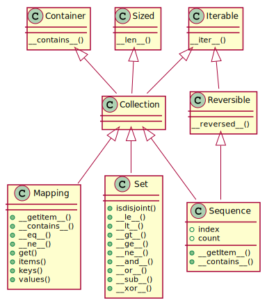

# Chapter 1: The Python Data Model
 Python Data Model is a description of Python as a Framework.
 - *Magic method* or *Dunder method* is slang for special method(__ before & after).
```python
class NewCollection:
    def __init__(self):
        # define constructor NewCollection()
        pass

    def __len__(self):
        # define len(NewCollection())
        return 0

    def __getitem__(self, position):
        # define NewCollection()[position], iterable
        return f'item({position})'

    def __contains__(self, item):
        # optional method instead it does a sequential scan
        return True
```
- By implementing *\_\_len\_\_* & *\_\_getitem\_\_* the object is behaving like a standard **sequence** object.
- *for in* call *\_\_iter\_\_* if it's available otherwise it calls *\_\_getitem\_\_*
- *Special methods* are meant to be called by Python interpreter(optimized for built in structure) or to be called by *function*.
- *\_\_init\_\_* is frequently called to invoke the *super* constructor.
- Avoid creating arbitrary custom attribute with *\_\_*.
## Emulating Numeric Types
````python
def __add__(self, other):
    # called with +
    pass

def __bool__(self):
    # bool(x) call x.__bool__() or x.__len__() 
    # 0 is False otherwise is True
    pass

def __mul__(self, other):
    # called with *
    pass

def __abs__(self):
    # called with abs(x)
    pass
````
## Collection API
All the classes in the diagram are ABCs --*abstract base classes* (new in Python 3.6).

## Every collection should implements
- Iterable: supporting *for*
- Sized: supporting *len*
- Contains: supporting *in*
> Python doesn't require concrete class to inherit any of ABC classes (just implementing th methods does)
### collection Specializations
- Sequence: implemented by *list* and *str*;
- Mapping: implemented by *dict* and *collections.defaultdict*;
- Set: implemented by *set* and *frozenset*;
> Only *Sequence* is *Reversible* because sequence support arbitrary ordering.
## Special Methods
| Category | Method names |
| --- | --- |
| String/Byte | repr, str, format, bytes, fspath |
| Number | abs, bool, complex, int, float, hash, index |
| Collection | len, getitem, setitel, delitem, contains |
| Iteration | iter, aiter, next, anext, reversed |
| Callable | call, await |
| Context | enter, aenter, exit, aexit | 
| Instance | new, init, del |
| Attribute management | getattr, getattribute, setattribute, delattribute, del | 
| Attribute descriptors | get, set, delete, set_name | 
| Class service | prepare, init_subclass, instancecheck, subclasscheck | 
## Why *len* is not a method
*len* is not called as a method because it gets special treatment as part of Python Data Model.
> practicality beats purity. (**The Zen of Python**)


